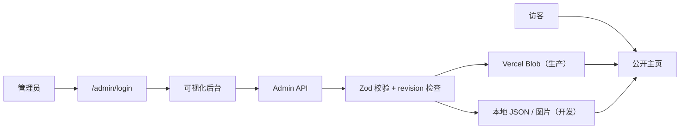

# Personal Site Studio

一个面向个人主页的模块化内容系统：前台展示个人介绍、工作经历、旅行足迹、个人项目与生活内容，后台负责内容维护、页面排序、图片上传和多版本管理。

[](https://github.com/lrwei91/Blog/actions/workflows/ci.yml)


[](LICENSE)

本仓库基于 [Bio Blocks Studio](https://github.com/JiahaoTang-Alvin/bio-blocks-studio) 深度定制。当前版本已经从通用积木主页扩展为一套单管理员、自托管的个人内容工作台。

## 项目定位

Personal Site Studio 适合希望长期维护个人主页、又不想为每次内容更新修改代码的人。

- 主页内容由后台统一维护。
- 页面模块可以显示、隐藏、排序和预览。
- 生产环境使用 Vercel Blob 持久化配置与图片。
- 本地开发不依赖云存储，可直接写入仓库内的本地数据目录。
- 支持不同访问版本和多语言内容，但不提供公开注册或访客写入。

它不是完整 CMS，也不包含账号体系、评论、点赞、访问统计或多人协作权限。

## 当前功能

### 公开主页

- 个人介绍：头像、姓名、职业定位、简介、标签、所在地和社交链接。
- 核心技能：用统一卡片展示能力领域和说明。
- 工作经历：时间轴、公司信息、职位、摘要和详情弹窗。
- 旅行足迹：基于真实中国地图轮廓展示城市、路线和地点说明。
- 个人项目：展示 GitHub 仓库、线上地址和项目简介。
- 此刻 NOW：记录近期状态、关注事项、心情、地点、标签和更新时间。
- 最近在看 / 玩 / 听：支持电影、书籍、游戏、音乐及其他分类。
- 照片故事：支持多图、图片说明、排序和灯箱预览。
- 导航：展示前五个已发布模块，其余内容收进“更多”。
- 页面工具：返回顶部、系统分享与复制链接降级。
- 动效、图片预览和公开分享均可通过后台设置独立开关。

### Admin 后台

- 密码登录与签名会话。
- 个人资料、SEO、主题、功能开关和社交链接编辑。
- 通用卡片的新增、编辑、删除、显示、排序和尺寸调整。
- 工作经历、旅行、项目、NOW、媒体和照片故事的专用表单。
- 图片上传、图片预览和已有图片地址复用。
- 配置导入、导出与保存前预览。
- 保存时进行 Zod 校验和 revision 并发冲突检查。

后台的“页面结构”面板用于管理模块级顺序：

- 搜索并筛选已发布或隐藏模块。
- 点击模块定位到画布，或直接打开编辑表单。
- 支持拖拽、键盘排序、上移、下移、置顶和置底。
- 标题与其内容会作为完整模块移动，特殊模块不会被拆散。
- 每次排序可撤销一次；搜索或筛选生效时会暂停拖拽。

画布仍负责内容预览、普通子卡片排序、二维排版和尺寸调整。

### 多版本与多语言

站点支持一份主版本和多个独立内容版本。每个版本可以有自己的：

- 个人资料与主题。
- 页面模块和排序。
- 可选访问码。
- 语言配置。

访问码会以 SHA-256 摘要保存，不保留明文。通过访问码进入版本后，服务端会写入签名 Cookie，默认允许后续 10 次访问。此功能用于隐藏入口和内容分流，不等同于严格的权限系统。

## 技术栈

| 层级 | 实现 |
| --- | --- |
| 应用框架 | Next.js 16 App Router |
| UI | React 18、Tailwind CSS 3、Lucide React |
| 语言 | TypeScript 5 |
| 配置校验 | Zod |
| 交互与排序 | dnd-kit、CSS / Web Animations API |
| 生产存储 | Vercel Blob |
| 本地存储 | JSON 文件与本地图片目录 |
| 测试 | Vitest |
| 持续集成 | GitHub Actions |

## 工作原理



配置读取顺序如下：

1. 已配置 Blob 时，读取 `config/site-config.json`。
2. 本地无 Blob 时，读取 `local-data/site-config.json`。
3. 尚未保存任何配置时，使用 `lib/default-site-config.ts`。

## 快速开始

### 环境要求

- Node.js 20 或更高版本
- npm

### 安装与启动

```bash
git clone https://github.com/lrwei91/Blog.git
cd Blog
npm ci
cp .env.example .env.local
```

至少配置一个后台登录凭据：

```dotenv
ADMIN_PASSWORD=replace-with-a-strong-password
SESSION_SECRET=replace-with-at-least-32-random-characters
```

启动开发服务器：

```bash
npm run dev
```

打开：

- 主页：<http://localhost:3000>
- 后台：<http://localhost:3000/admin>
- 登录：<http://localhost:3000/admin/login>

本地开发不配置 `BLOB_READ_WRITE_TOKEN` 也可以保存内容和上传图片。配置会写入 `local-data/site-config.json`，图片会写入 `public/images/` 下的对应目录。

### 使用密码哈希

生产环境建议使用 `ADMIN_PASSWORD_HASH`，它的优先级高于明文密码：

```bash
node -e "require('bcryptjs').hash(process.argv[1], 12).then(console.log)" "your-password"
```

把输出值写入：

```dotenv
ADMIN_PASSWORD_HASH=$2b$12$...
```

## 环境变量

| 变量 | 是否必需 | 说明 |
| --- | --- | --- |
| `ADMIN_PASSWORD` | 二选一 | 后台明文密码，适合本地开发 |
| `ADMIN_PASSWORD_HASH` | 二选一 | bcrypt 密码摘要；设置后优先使用 |
| `SESSION_SECRET` | 生产必需 | 签名后台会话和版本 Cookie，建议至少 32 个随机字符 |
| `BLOB_READ_WRITE_TOKEN` | 生产必需 | Vercel Blob 读写令牌 |
| `NEXT_PUBLIC_SITE_URL` | 推荐 | 站点公开地址，用于 SEO 和分享元数据 |

完整示例见 [`.env.example`](.env.example)。

## 后台使用流程

1. 进入 `/admin/login` 并登录。
2. 编辑个人资料、主题、SEO 和功能开关。
3. 在“页面结构”中调整模块顺序和发布状态。
4. 在画布或模块编辑入口维护具体内容。
5. 使用预览检查前台效果。
6. 保存配置；若远端 revision 已变化，后台会阻止覆盖并提示重新加载。

新建的 NOW、媒体和照片故事模块默认可以保持隐藏，补齐真实内容后再发布。

### 通用内容块

后台仍支持适合自由排版的通用卡片：

- 文本
- 图片
- 视频
- 链接
- 项目
- 社交卡片
- 状态卡片

### 特殊主页模块

特殊模块拥有独立数据结构和编辑器：

| 模块 | 主要数据 |
| --- | --- |
| 工作经历 | 公司、职位、任职时间、摘要、详情 |
| 旅行足迹 | 城市、省份、经纬度、说明、路线 |
| 个人项目 | 名称、简介、GitHub、线上地址 |
| 此刻 NOW | 状态、心情、地点、标签、更新时间 |
| 最近在看 / 玩 / 听 | 分类、封面、状态、评分、短评、外链 |
| 照片故事 | 标题、日期、地点、简介、多张照片与说明 |

## 数据与图片

### 生产环境

- 配置文件：Vercel Blob 中的 `config/site-config.json`
- 图片：通过后台上传到 Vercel Blob
- 单张图片上限：5 MB
- 支持格式：JPEG、PNG、WebP、GIF

### 本地开发

- 配置文件：`local-data/site-config.json`
- 图片目录：
  - `public/images/avatar/`
  - `public/images/blocks/`
  - `public/images/gallery/`
  - `public/images/qrcode/`

`local-data/` 用于本地运行数据，不应被当作多用户数据库。部署到无持久磁盘的运行环境时必须使用 Blob。

### URL 安全

后台只接受以下链接：

- `http://`
- `https://`
- `mailto:`
- `tel:`
- 站内相对路径

其他协议会被配置校验拒绝。

## 路由

| 路由 | 用途 |
| --- | --- |
| `/` | 主版本主页 |
| `/[locale]` | 主版本的语言页面 |
| `/[accessCode]` | 通过访问码进入指定版本 |
| `/[accessCode]/[locale]` | 指定版本的语言页面 |
| `/reset` 或 `/?reset` | 清除版本选择状态并返回主版本 |
| `/admin` | 后台编辑器 |
| `/admin/login` | 后台登录 |

## 安全边界

- 后台会话使用签名的 HTTP-only Cookie，有效期 7 天。
- 生产环境 Cookie 会启用 `Secure`。
- 保存接口要求有效后台会话。
- 配置保存前会执行结构、评分范围和 URL 协议校验。
- revision 用于避免两个编辑会话静默覆盖彼此的配置。
- 访问码版本是内容隐藏机制，不应承载敏感或机密数据。
- 仓库不应提交真实密码、Blob Token 或 `SESSION_SECRET`。

## 部署

推荐部署到 Vercel。

1. 将仓库导入 Vercel。
2. 创建 Blob Store，并把 `BLOB_READ_WRITE_TOKEN` 注入项目环境变量。
3. 配置 `ADMIN_PASSWORD_HASH`、`SESSION_SECRET` 和 `NEXT_PUBLIC_SITE_URL`。
4. 执行生产部署。
5. 首次进入 `/admin` 保存配置，确认 Blob 中已经生成 `config/site-config.json`。

生产运行时缺少 `BLOB_READ_WRITE_TOKEN` 会直接报错，避免把内容误写到不可持久化的临时磁盘。

## 开发命令

| 命令 | 说明 |
| --- | --- |
| `npm run dev` | 启动本地开发服务器 |
| `npm run lint` | 运行 ESLint |
| `npm run typecheck` | 运行 TypeScript 类型检查 |
| `npm test` | 运行 Vitest 测试 |
| `npm run build` | 创建生产构建 |
| `npm start` | 启动生产服务器 |

GitHub Actions 会在推送到 `main` 或创建 Pull Request 时依次执行：

1. `npm ci`
2. `npm run lint`
3. `npm run typecheck`
4. `npm test`
5. `npm run build`

## 目录结构

```text
app/
  admin/                  后台页面
  api/admin/              登录、配置与上传接口
  [accessCode]/           版本和语言路由
components/
  admin/                  后台画布、结构面板与编辑表单
  site/                   公开主页与特殊模块
  blocks/                 通用内容卡片
lib/
  default-site-config.ts  默认站点配置
  local-config.ts         本地配置读写
  site-config.ts          配置加载与生产存储
  validators.ts           Zod 与 URL 校验
types/                    TypeScript 数据类型
public/images/            本地图片
tests/                    单元测试
```

## 开发约定

- 新增配置字段时，同步更新 TypeScript 类型、默认配置和 Zod Schema。
- 新增特殊模块时，同步接入前台渲染、后台编辑、页面结构分组和导航可见性。
- 排序继续写回现有 `sortOrder`，不要依赖数组当前位置。
- 所有外链进入配置前必须经过安全 URL 校验。
- 修改后台保存逻辑时保留 revision 并发控制。
- 用户可见功能变更需要同时检查默认配置和 README。

提交前建议运行：

```bash
npm run lint
npm run typecheck
npm test
npm run build
```

## License

本项目使用 [MIT License](LICENSE)。

原始项目版权归 Jiahao Tang 所有；本仓库保留原许可，并在其基础上进行个人化功能与界面改造。
